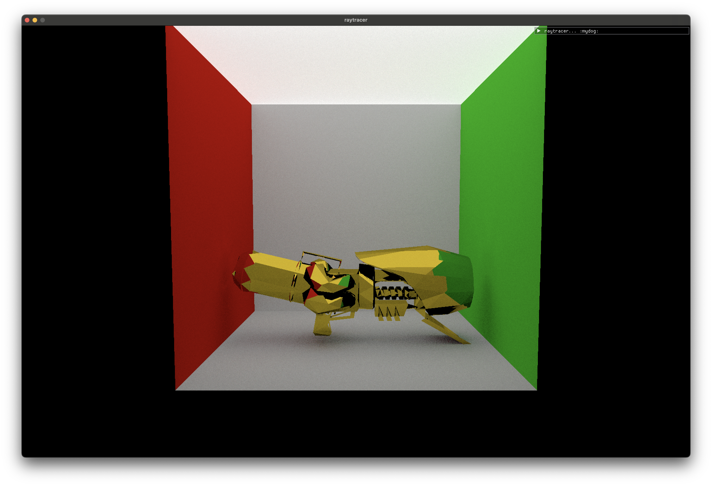
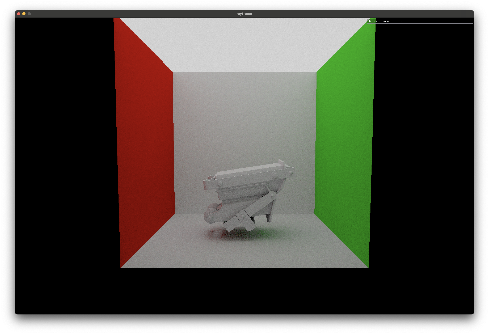

# Vulkan Path Tracer
A Vulkan-based compute raytracer written in C++. Code skeleton from *[VkGuide](https://vkguide.dev/)*.

## Features
- Sphere and triangle primitives
- Diffuse and specular materials
- Wavefront OBJ and texture loading
- ImGui implementation

## Planned Features
- Transparent materials
- Dynamic camera system
- Bounding Volume Hierarchies
- Importance Sampling
- Disney's BRDF

## Renders

Model and textures from *[The Model's Resource](https://www.models-resource.com/nintendo_switch/splatoon3/model/59382/)*

Model from *[The Model's Resource](https://www.models-resource.com/nintendo_switch/splatoon3/model/61025/)*

Model from *[Sketchfab](https://sketchfab.com/3d-models/splatoon-3-dread-wringer-9a07bd24e0184e6084389f1da41a9818)*

