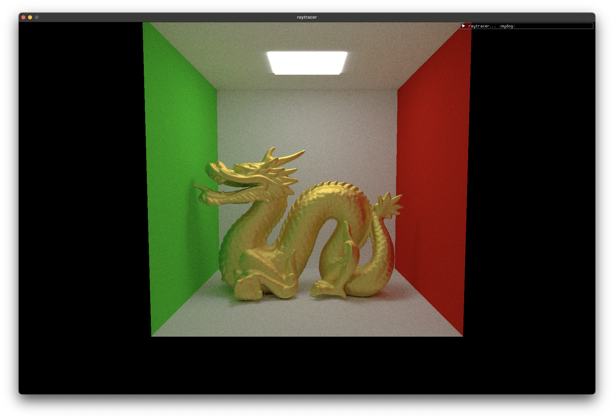
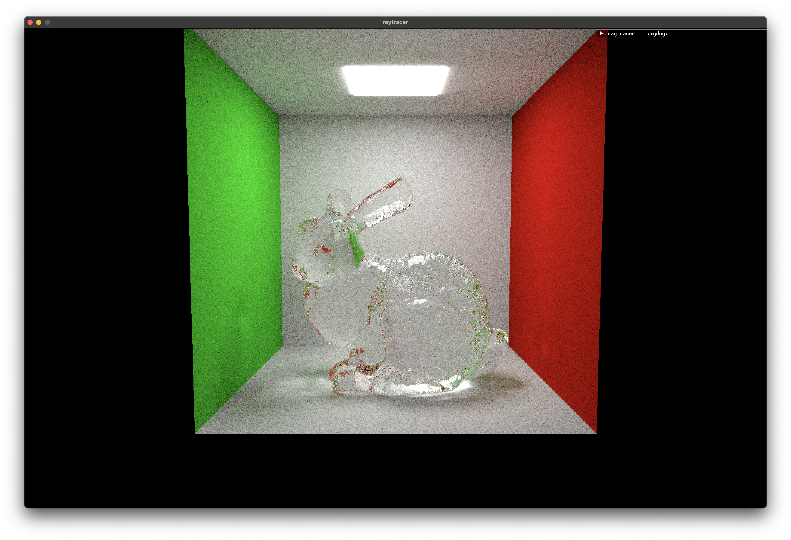

# Vulkan Path Tracer
A Vulkan-based compute path tracer written in C++. Code skeleton from *[VkGuide](https://vkguide.dev/)*.

## Features
- Sphere and triangle primitives
- Diffuse, metallic, and dielectric materials
- Wavefront .obj and .mtl loading
- ImGui implementation
- Bounding volume hierarchies
- Next event estimation
- Multiple importance sampling

## Planned Features
- Dynamic camera system
- Disney's BSDF
- Wavefront path tracing

## Renders

Crytek Sponza from *[McGuire Computer Graphics Archive](https://casual-effects.com/data/)*

Eggplant dog model by *[puuulppp](https://twitter.com/puuulppp?lang=en)*

Dragon from *[The Stanford 3D Scanning Repository](http://graphics.stanford.edu/data/3Dscanrep/)*

Bunny from *[The Stanford 3D Scanning Repository](http://graphics.stanford.edu/data/3Dscanrep/)*