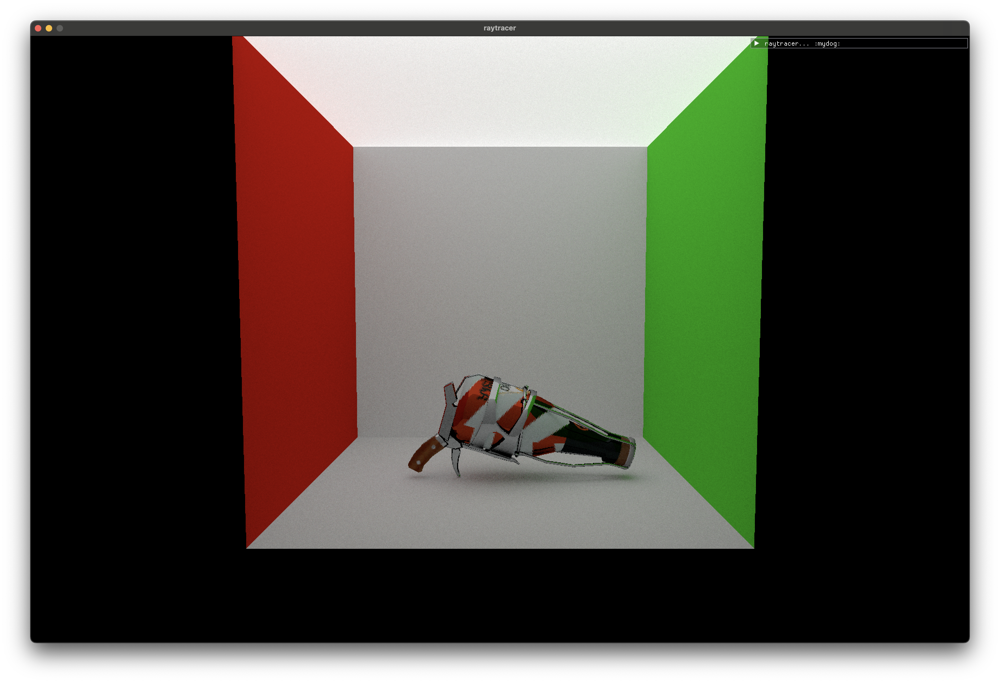

# Vulkan Path Tracer
A Vulkan-based compute raytracer written in C++. Code skeleton from *[VkGuide](https://vkguide.dev/)*.

## Features
- Sphere and triangle primitives
- Diffuse, metallic, and dielectric materials
- Wavefront OBJ and texture loading
- ImGui implementation
- Bounding volume hierarchies

## Planned Features
- Dynamic camera system
- Importance sampling
- Disney's BRDF

## Renders

Model and textures from *[The Model's Resource](https://www.models-resource.com/nintendo_switch/splatoon3/model/59382/)*

Model from *[Sketchfab](https://sketchfab.com/3d-models/suzanne-blender-monkey-3a0647fba1654920b09ba4d11967e8cc)*

Model from *[The Stanford 3D Scanning Repository](http://graphics.stanford.edu/data/3Dscanrep/)*